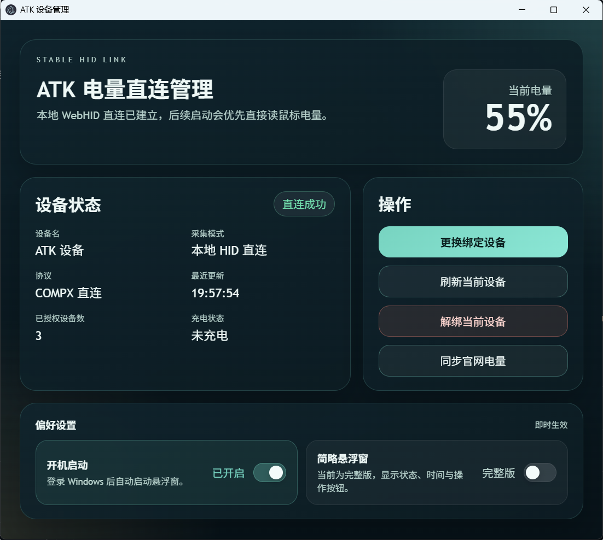
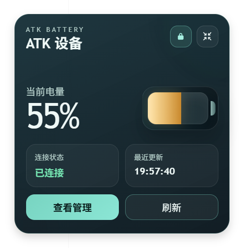

# ATK 电量悬浮窗

一个基于 Electron 的 Windows 桌面工具，用于显示 ATK / VXE 鼠标电量。

项目默认优先使用原生 `HID`（`node-hid`）在独立 `utilityProcess` 子进程中直连读取电量；当当前设备协议暂未适配时，可切换到“同步官网电量”方案继续使用。

## 功能特性

- 原生 `HID` 子进程直连读取鼠标电量，主进程与 HID 驱动隔离，偶发崩溃不影响主窗口
- 完整版 / 简略版悬浮窗切换，位置记忆
- 托盘图标动态渲染当前电量数字与充电态
- 设备管理页支持设备选择、绑定、更换绑定、解绑与状态查看
- 支持记住上次成功连接的设备并在下次启动时自动复连
- 支持系统休眠 / 唤醒后自动重连
- 支持开机启动与悬浮窗置顶
- 协议未适配时可切换到“同步官网电量”方案

## 界面截图

<table>
  <tr>
    <td align="center"><strong>设备管理页</strong></td>
    <td align="center"><strong>完整版悬浮窗</strong></td>
  </tr>
  <tr>
    <td></td>
    <td></td>
  </tr>
</table>

## 技术栈

- Electron（主进程 + 渲染进程 + `utilityProcess` 子进程）
- `node-hid` 原生 HID
- 原生 HTML / CSS / JavaScript
- CommonJS

## 运行环境

- Windows 11
- Node.js 18+
- npm 9+
- 鼠标建议使用 `2.4G` 或有线模式

## 快速开始

### 1. 安装依赖

```bash
npm install
```

### 2. 启动项目

```bash
npm start
```

如需查看更详细的 Electron 启动日志，可使用：

```bash
npm run start:verbose
```

## 首次使用

1. 启动应用后，会先显示电量悬浮窗。
2. 点击悬浮窗中的 `设备管理`。
3. 在设备管理页点击 `选择并绑定设备`。
4. 在弹出的 HID 设备列表中选择目标鼠标或接收器。
5. 绑定成功后，应用会优先记住并读取这只设备的电量，下次启动自动复连。
6. 如果当前型号协议暂未适配，可点击 `同步官网电量` 继续使用。

## 使用说明

### 悬浮窗

- 支持完整版和简略版两种显示模式
- 支持拖动位置，切换模式时会保持位置同步
- 支持置顶显示
- 支持托盘显示 / 隐藏悬浮窗

### 设备管理

- 查看当前连接状态、设备名、协议、最近更新时间
- 选择并绑定设备，或更换当前绑定设备
- 手动刷新当前绑定设备
- 解绑当前设备
- 切换悬浮窗模式
- 设置开机启动

### 托盘菜单

- 显示 / 隐藏悬浮窗
- 打开设备管理
- 刷新直连状态
- 查看当前电量、设备与协议状态
- 切换置顶、简略悬浮窗、开机启动

## 项目结构

```text
.
├─ package.json
├─ README.md
├─ build/                        # 打包辅助脚本（after-pack 等）
└─ src
   ├─ main.js                    # 应用入口：单例锁、模块装配、生命周期
   ├─ core/                      # 核心状态与业务动作
   │  ├─ battery-runtime.js      #   HID 运行时句柄持有
   │  ├─ constants.js            #   常量
   │  ├─ device-actions.js       #   设备绑定/解绑/置顶切换等动作
   │  ├─ overlay-source.js       #   悬浮窗数据源切换（manager / hub）
   │  ├─ overlay-state.js        #   悬浮窗状态总线
   │  ├─ settings-store.js       #   设置订阅与合并
   │  └─ store.js                #   settings.json 持久化
   ├─ device/                    # 设备识别与选择
   │  ├─ device-binding.js       #   绑定偏好
   │  ├─ device-matcher.js       #   设备匹配规则
   │  ├─ device-name.js          #   设备名归一化
   │  └─ hid-selection.js        #   HID 列表选择
   ├─ hid/                       # 原生 HID 协议层
   │  ├─ native-hid.js           #   协议核心实现
   │  ├─ native-hid-host.js      #   主进程端 utilityProcess 编排
   │  └─ native-hid-worker.js    #   子进程端：隔离 node-hid 崩溃
   ├─ ipc/                       # IPC 通道
   │  ├─ index.js                #   IPC 聚合注册
   │  ├─ manager-ipc.js          #   设备管理页通道
   │  ├─ overlay-ipc.js          #   悬浮窗通道
   │  └─ hub-ipc.js              #   同步官网电量通道
   ├─ preload/                   # 预加载脚本
   │  ├─ manager-preload.js
   │  ├─ overlay-preload.js
   │  └─ hub-preload.js
   ├─ renderer/                  # 渲染进程 UI
   │  ├─ manager.html / .css / .js
   │  ├─ manager/                #   设备管理页拆分
   │  │  ├─ actions.js
   │  │  ├─ dom-refs.js
   │  │  ├─ hid-dialog.js
   │  │  ├─ state.js
   │  │  └─ ui-utils.js
   │  ├─ overlay.html / .css / .js
   │  └─ hid-shared.js           #   渲染进程公用工具
   ├─ system/                    # 系统层集成
   │  ├─ login-item.js           #   开机启动
   │  ├─ power-monitor.js        #   休眠/唤醒重连
   │  └─ runtime-diagnostics.js  #   主进程崩溃兜底自重启
   ├─ tray/                      # 系统托盘
   │  ├─ tray.js                 #   托盘菜单
   │  ├─ tray-icon-renderer.js   #   图标缓存与渲染
   │  └─ png-encoder.js          #   托盘电量 PNG 生成
   ├─ utils/                     # 通用工具
   │  ├─ logger.js               #   文件 + 控制台日志
   │  ├─ memory-log.js           #   内存快照
   │  └─ window-helpers.js       #   窗口显隐辅助
   └─ windows/                   # 主进程窗口管理
      ├─ overlay-window.js
      ├─ manager-window.js
      ├─ hub-window.js
      └─ window-icons.js
```

## 数据存储

应用会将本地配置写入 Electron `userData` 目录下的 `settings.json`，内容包括：

- 悬浮窗位置
- 设备偏好
- 记住的显示设备名
- 是否置顶
- 是否开机启动
- 当前悬浮窗模式

## 开发说明

当前可用脚本：

```bash
npm start              # 启动 Electron
npm run start:verbose  # 启动并输出详细 Electron 日志
npm run build:win      # 打包 Windows NSIS 安装包
```

关键模块速查：

- [src/main.js](src/main.js)：单例锁、模块装配、应用生命周期
- [src/hid/](src/hid/)：原生 HID 协议层，主进程与 `utilityProcess` 子进程通信
- [src/core/battery-runtime.js](src/core/battery-runtime.js) + [src/core/overlay-state.js](src/core/overlay-state.js)：电量运行时与状态总线
- [src/renderer/manager.js](src/renderer/manager.js) + [src/renderer/manager/](src/renderer/manager/)：设备管理页（枚举、授权、轮询、重试）
- [src/renderer/overlay.js](src/renderer/overlay.js)：悬浮窗 UI 状态渲染
- [src/tray/tray.js](src/tray/tray.js)：托盘菜单与图标更新
- [src/system/runtime-diagnostics.js](src/system/runtime-diagnostics.js)：主进程异常兜底自重启

## 已知限制

- 目前只覆盖了已分析并适配的部分设备协议，未覆盖型号会显示为 `待适配`
- 蓝牙模式下通常较难稳定读取，建议优先使用 `2.4G` 或有线连接
- 多设备同时连接时，会优先使用上次成功连接的设备，否则按鼠标特征自动选择
- “同步官网电量”方案依赖官网页面结构，官网改版后可能需要重新适配

## License

ISC
