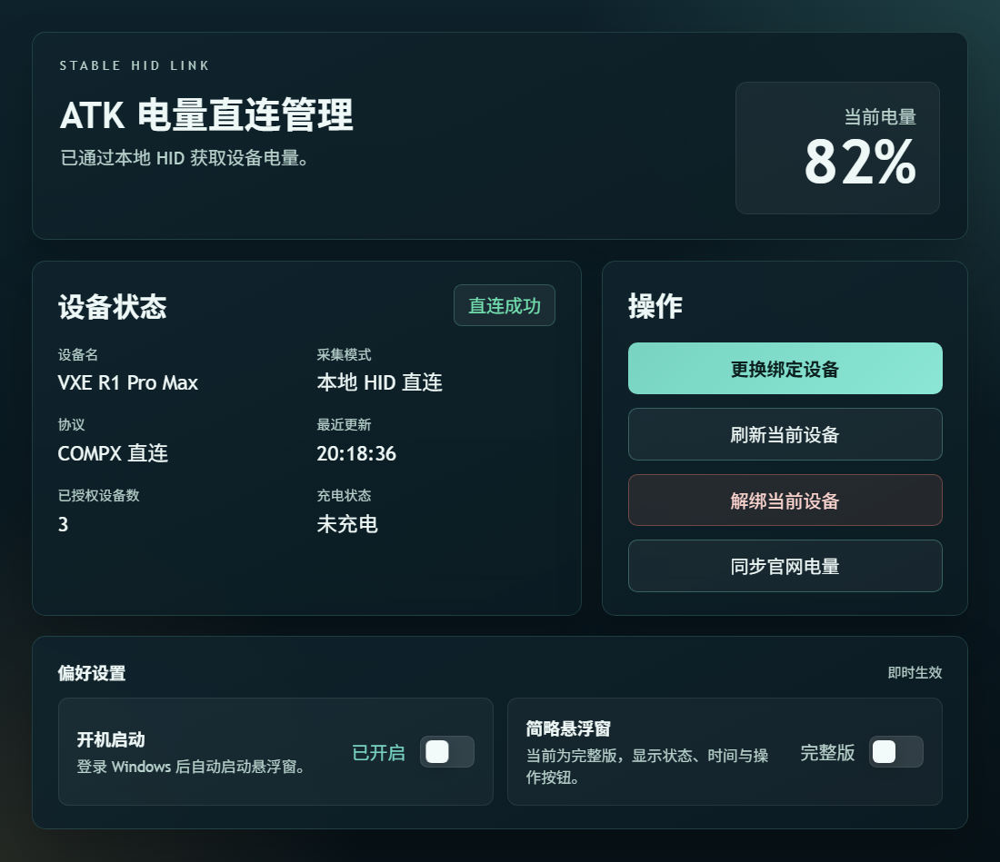
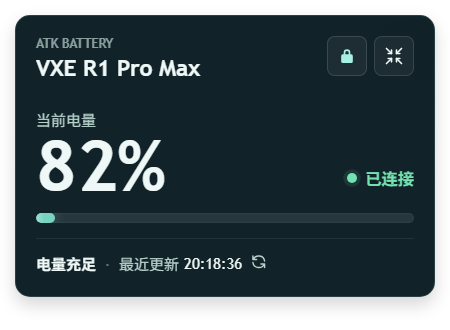

# ATK 电量悬浮窗

面向 Windows 11 的轻量桌面工具，显示 ATK / VXE 鼠标电量。

基于 Tauri 2、Rust、系统 WebView2 和 `hidapi`。HID 协议读取、设备枚举、后台轮询、托盘和窗口生命周期全部运行在 Rust 侧，安装包不携带 Chromium 或 Node.js 运行时。

## 功能

- COMPX / HECHI 原生 HID 电量读取，双协议自动探测与降级
- 设备选择、绑定、更换和自动复连
- 完整版 / 简略版悬浮窗，位置记忆
- 设备管理页位置与宽度记忆
- 托盘图标动态显示电量数字（Bahnschrift 字体，满电显示 `F`）
- 设备插拔即时重扫，系统休眠恢复后自动重连
- 前台 10 秒轮询；后台按充电态和电量调整为 2、5 或 10 分钟
- 单实例、开机启动、悬浮窗置顶
- ATK HUB 官网同步电量，开启后持续生效并在重启后自动恢复

## 界面截图

<table>
  <tr>
    <td align="center"><strong>设备管理页</strong></td>
    <td align="center"><strong>完整版悬浮窗</strong></td>
  </tr>
  <tr>
    <td></td>
    <td></td>
  </tr>
</table>

## 电量来源

应用有两种采集模式，同一时刻只有一种生效。

**本地 HID 直连**（默认）：绑定设备后由 Rust 工作线程直接读取 COMPX 或 HECHI 协议。绑定的设备身份包含 VID、PID、产品名和接口签名，接口签名变化时按同产品降级匹配。

**官网同步**：协议未适配的型号可开启，由后台 WebView 窗口从 `hub.atk.pro` 采集。开启后写入配置持续生效，关闭窗口只是隐藏，同步继续运行；重启应用会自动恢复。三种操作会退出同步模式：手动关闭、绑定新设备、解绑设备。

## 开发环境

- Windows 11
- Node.js 18+ 与 npm 9+
- Rust stable（MSVC 目标）
- Visual Studio Build Tools：使用 C++ 的桌面开发
- Microsoft Edge WebView2 Runtime

Rust 工具链可安装到非系统盘。npm 脚本会读取 Windows 用户环境变量中的 `CARGO_HOME` 和 `RUSTUP_HOME`，无需当前终端已刷新 `Path`。

## 开发与构建

```powershell
npm install
npm start
```

```powershell
npm run check
npm run build:win:unpacked
npm run build:win
```

- `npm start`：启动 Tauri 开发版本
- `npm run check`：JavaScript 语法检查、桥接测试和 Rust 单元测试
- `npm run build:win:unpacked`：仅编译 release 可执行文件，输出在 `dist/`
- `npm run build:win`：生成 NSIS 安装包，输出在 `dist/`

release 使用 LTO、`opt-level = "z"`、单 codegen unit、panic abort 和符号剥离。安装包不内置 WebView2，复用 Windows 11 系统运行时。

## 项目结构

```text
.
├─ assets/screenshots/        # README 界面截图
├─ scripts/                   # 前端检查、图标生成与 Rust 工具启动适配
├─ src/renderer/              # HTML / CSS / JavaScript 界面
│  ├─ runtime-bridge.js       # Tauri command / event 到渲染层 API 的映射
│  ├─ hid-shared.js           # 设备命名与排序的共享逻辑
│  ├─ manager/                # 设备管理页模块
│  └─ overlay.js              # 悬浮窗
├─ src-tauri/
│  ├─ capabilities/           # Tauri 权限边界
│  ├─ scripts/                # ATK HUB 只读状态采集脚本
│  └─ src/
│     ├─ battery_service.rs   # HID 工作线程、轮询、退避与状态广播
│     ├─ device.rs            # HID 枚举、设备身份和候选评分
│     ├─ protocol.rs          # COMPX / HECHI 协议
│     ├─ commands.rs          # 前端命令边界
│     ├─ hub.rs               # 官网同步窗口与持久同步开关
│     ├─ hub_permissions.rs   # Edge WebHID 授权导入
│     ├─ state.rs             # 设置持久化与运行状态
│     ├─ system_tray.rs       # 托盘菜单和动态电量图标
│     ├─ tray_text.rs         # GDI 文字渲染
│     ├─ window_manager.rs    # 窗口生命周期与位置记忆
│     └─ windows_integration.rs # 设备变化与电源消息
└─ test/                      # 渲染层桥接测试
```

## 数据与安全边界

配置写入 Tauri 应用配置目录的 `settings.json`，首次启动兼容读取旧版 `%APPDATA%\atktool\settings.json`。

官网同步窗口仅允许导航到 `https://hub.atk.pro/`。状态回传必须来自该窗口和来源，且同步开关为开启状态，Rust 侧校验文本长度、电量范围与状态枚举后才接受。

渲染层通过 capability 白名单访问命令，本地窗口与 HUB 窗口的命令集互不重叠。

## 已知限制

- 只覆盖已适配的设备协议，未覆盖型号显示为「待适配」，可改用官网同步。
- 蓝牙模式通常无法稳定读取，建议使用 2.4G 接收器或有线连接。
- 官网同步依赖 hub.atk.pro 的页面结构，官网改版后可能需要更新采集规则。
- 托盘图标文字渲染依赖 Windows GDI 与 Bahnschrift 字体，非 Windows 平台不绘制数字。

## License

ISC
